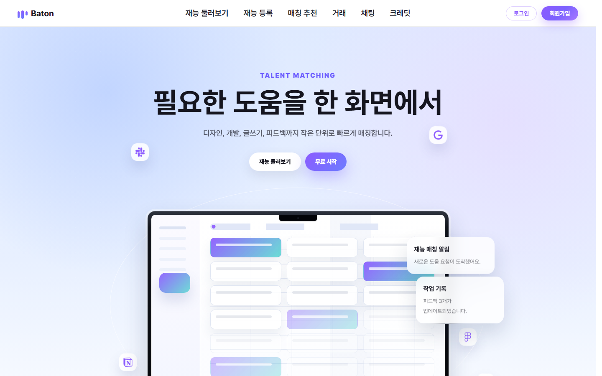
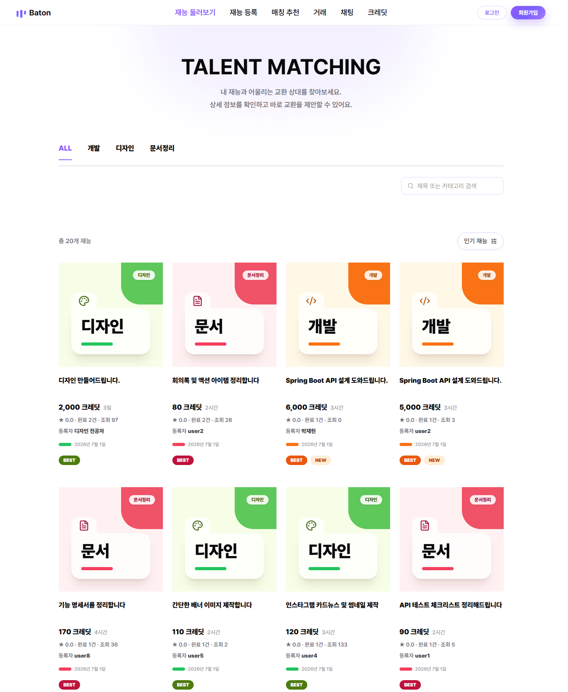
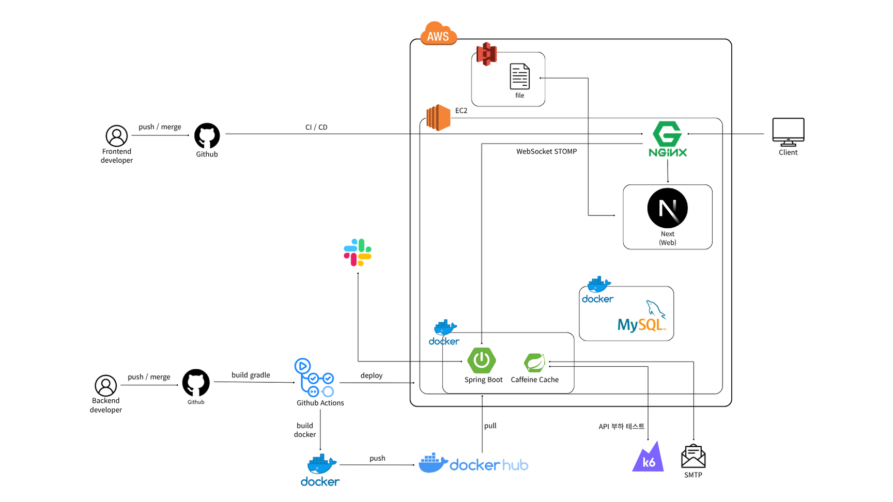
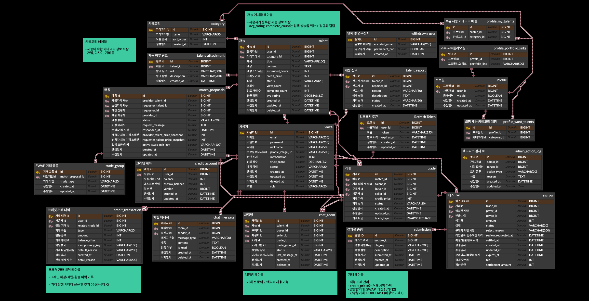

# Baton — 크레딧 기반 재능 거래 · 교환 플랫폼

> 돈이 아닌 재능을 시작점으로 삼는 거래 플랫폼.
> 현금 대신 크레딧으로 재능을 주고받고, 에스크로로 거래의 신뢰를 보장합니다.

- **서비스**: http://baton.io.kr
- **API 문서(Swagger)**: http://54.116.23.255/swagger-ui/index.html
- **Frontend 저장소**: https://github.com/prgrms-be-devcourse/NBE9-11-final-Team03-front

프로그래머스 데브코스 백엔드 과정 최종 팀 프로젝트입니다. (백엔드 5인, 2026.06.06 ~ 2026.07.01)



---

## 어떤 문제를 풀었나

포트폴리오용 사이트를 만들고 싶은 디자이너에게 개발 외주 견적은 100만 원. 반대로 그 개발자는 UI를 맡길 디자이너를 찾지 못합니다. 두 사람이 꼭 돈을 주고받아야 할까요?

| 문제 | Baton의 해결 |
|---|---|
| 현금 외주 비용 부담 | **크레딧 거래** — 재능을 제공해 얻은 크레딧으로 다른 재능을 구매 |
| 선결제 미이행 · 중간 이탈 | **에스크로** — 제안 수락 시 크레딧 예치, 구매 확정 시 정산 |
| 완료 · 환불 기준 불명확 | **상태 관리 + 분쟁 처리** — 거래 상태 전이 관리, 분쟁 시 크레딧 동결 후 관리자 판정 |

MVP는 단방향 거래(PURCHASE)와 에스크로 정산 흐름을 안정화하는 데 집중했고, 이후 양방향 재능 맞교환(SWAP)까지 확장했습니다.

## 주요 기능

- **회원/프로필** — JWT 인증, 가입 시 초기 크레딧 계좌 자동 생성(WELCOME 이력), 신뢰 점수
- **재능/카테고리** — 재능 등록·관리, 키워드·조건 기반 검색(QueryDSL 동적 쿼리 + Cursor 페이징), 카테고리 Caffeine 캐싱
- **매칭** — 구매·교환 제안, 보유 재능 ↔ 원하는 카테고리 교차 조건 기반 매칭 추천
- **거래/에스크로/크레딧** — PURCHASE 단건 거래, TradeGroup 기반 SWAP 양방향 거래, 에스크로 HELD → RELEASED 정산, CreditTransaction 원장 기록
- **실시간 채팅** — STOMP 기반 거래 협의 채팅 (SWAP은 거래 그룹당 채팅방 1개)
- **관리자/분쟁 처리** — 분쟁 시 에스크로 FROZEN, 관리자 판정으로 환불 또는 정산
- **운영** — S3 Presigned URL 파일 업로드, 7일 미확정 거래 자동 구매 확정 스케줄러, Slack 경보

**API 규모**: REST API 57개 + WebSocket(STOMP) 2개

| 재능 탐색 · 검색 |
|:---:|
|  |

## 거래 흐름

```
재능 등록 → 매칭 제안 → 제안 수락 → 크레딧 예치(HELD) → 결과물 제출 → 구매 확정 → 제공자 정산(RELEASED)
```

- 제안 수락 시 구매자의 크레딧이 에스크로에 잠기고, 구매 확정 시에만 제공자에게 정산됩니다.
- 분쟁이 신청되면 에스크로를 동결(FROZEN)하고 관리자가 판정합니다 — 구매자 승소 시 환불(REFUNDED), 판매자 승소 시 정산(RELEASED).
- 판매자가 제출한 뒤 구매자가 7일간 응답하지 않으면 스케줄러가 자동 구매 확정 처리하고 결과를 Slack으로 알립니다.

## 시스템 아키텍처



- GitHub Actions가 빌드·테스트 후 Docker 이미지를 Docker Hub에 푸시하고 EC2에 배포합니다.
- EC2에서 Nginx가 웹(Next.js)과 API(Spring Boot)로 라우팅하고, WebSocket(STOMP)도 함께 프록시합니다.
- 파일은 Presigned URL로 클라이언트가 S3에 직접 업로드해 서버 트래픽을 우회합니다.
- k6로 배포 환경에 부하 테스트를 수행하고, 운영 이벤트는 Slack으로 전송됩니다.

## ERD

<details>
<summary><b>전체 ERD 펼쳐보기</b> (테이블 20개)</summary>



</details>

핵심 흐름: `User ↔ Talent ↔ MatchProposal ↔ Trade(+TradeGroup) ↔ Escrow ↔ CreditTransaction`

- `credit_account`는 가용 잔액과 에스크로 보류 잔액을 분리해 관리하고, `CHECK >= 0` 제약과 낙관적 락 버전 컬럼을 둡니다.
- `credit_transaction`은 수정·삭제 없이 행을 추가만 하는 원장(ledger) 구조입니다.
- SWAP은 `trade_group` 1건 + `trade` 2건으로 모델링해 양방향 거래를 하나의 흐름으로 관리합니다.

## 기술 스택

| 구분 | 기술 |
|---|---|
| Backend | Java 21, Spring Boot, Spring Data JPA, QueryDSL, Spring Security + JWT, WebSocket(STOMP) |
| Database / Cache | MySQL, H2(테스트), Caffeine |
| Infra | AWS EC2 · S3, Nginx, Docker & Docker Compose, GitHub Actions CI/CD |
| Test / Quality | JUnit 5, JaCoCo, k6, Sentry · Slack 모니터링 |
| Docs | SpringDoc OpenAPI (Swagger) |

## 기술적 의사결정

측정과 비교로 선택한 것들입니다. 자세한 내용은 [docs](./docs)의 품질·성능 리포트에 있습니다.

- **Cursor 페이징 (vs Offset)** — talent 10만 건 시드 후 `EXPLAIN ANALYZE`로 90,000번째 페이지 접근을 측정. 스캔 row 90,020 → 20, 실행 시간 ~29ms → ~0.18ms. deep paging 비용을 확인하고 Cursor를 채택했습니다.
- **S3 Presigned URL (vs 서버 경유 업로드)** — 파일이 서버 메모리·트래픽을 통과하지 않도록 클라이언트가 S3에 직접 업로드하는 방식을 채택했습니다.
- **Caffeine 로컬 캐시 (vs Redis)** — 단일 서버 구성에서 분산 캐시는 과설계라고 판단했습니다. 카테고리 조회 5회 기준 DB 조회 5회 → 1회(80% 감소). 응답 시간은 캐싱 전에도 1ms 미만이라 유의미한 차이가 없었고, 목적을 "반복 DB 조회 제거"로 정직하게 정의했습니다.
- **크레딧 동시성 제어** — 상태 전이가 중요한 거래에는 비관적 락, 가감산이 빈번한 크레딧 차감에는 DB 원자적 업데이트를 적용. k6 50VU 테스트에서 처리량 2.61배, 평균 응답 36ms → 6ms.

## 품질 · 성능

- **테스트**: JUnit 단위·통합 테스트 475개, JaCoCo Line 87% / Branch 74% (2026-06-18 리포트 기준)
- **k6 부하 테스트** (NFR: 300ms 이내):

| API | Requests | Avg | p95 | 실패율 |
|---|---|---|---|---|
| GET /api/v1/talents/search | 62,459 | 22.16ms | 36.67ms | 0.00% |
| GET /api/v1/match-recommendations | 66,332 | 38.30ms | 81.32ms | 0.00% |
| GET /api/v1/credit/transactions | 57,680 | 17.63ms | 27.30ms | 0.00% |
| POST /api/v1/chat-rooms/{id}/messages | 67,725 | 20.97ms | 34.88ms | 0.00% |

## 실행 방법

```bash
# 로컬 실행
./gradlew bootRun
# Swagger: http://localhost:8080/swagger-ui/index.html

# Docker Compose
docker compose up -d
```

## 팀 구성

| 팀원 | 역할 | 담당 도메인 |
|---|---|---|
| 남진우 | 팀장(PO) · 아키텍트형 역할 | 관리자 모니터링(ADMIN) |
| **박재현** | **아키텍트형 역할 · API 구현** | **재능(TALENT) · 카테고리(CATEGORY)** |
| 이유진 | API 구현 · AWS 담당 | 회원(USER) · 프로필(PROFILE) |
| 이인희 | API 구현 · 성능 개선 · 프론트엔드 담당 | 매칭(MATCHING) · 채팅(CHAT) |
| 최윤서 | API 구현 · 성능 개선 | 크레딧(CREDIT) · 에스크로(ESCROW) · 거래(TRADE) |

협업: Jira 티켓 관리 · 브랜치 전략 · PR 리뷰 · Squash merge

---

## Talent/Category 도메인

> 이 저장소는 팀 저장소([prgrms-be-devcourse/NBE9-11-final-Team03](https://github.com/prgrms-be-devcourse/NBE9-11-final-Team03))의 포크입니다. 아래는 제가 담당한 재능(Talent)·카테고리(Category) 도메인의 작업 내용입니다.

**담당 범위**: 재능 CRUD·목록·검색, 커서 페이징, S3 Presigned URL 첨부, 재능 신고, 카테고리 조회·캐싱

| 코드 위치 | 내용 |
|---|---|
| [`domain/talent`](src/main/java/com/back/baton/domain/talent) | 재능 CRUD · 검색 · 첨부 · 신고 |
| [`domain/category`](src/main/java/com/back/baton/domain/category) | 카테고리 조회 · 캐싱 |
| [`global/config/CacheConfig.java`](src/main/java/com/back/baton/global/config/CacheConfig.java) | Caffeine 캐시 설정 |

### 1. 커서 기반 목록 · 검색 — 정렬 3종을 keyset으로 처리

`GET /api/v1/talents`(목록) · `GET /api/v1/talents/search`(검색)에 Cursor 페이징을 적용했습니다.

- 정렬(최신순 `LATEST` · 평점순 `RATING` · 인기순 `POPULAR`)별로 커서 조건을 분기했습니다. 최신순은 `id < cursor` 단일 조건, 평점순·인기순은 커서 id의 정렬값을 조회한 뒤 `정렬값 < anchor OR (정렬값 = anchor AND id < cursor)` 복합 비교로 동점(tie)에서도 누락·중복 없이 이어지도록 했습니다.
- 모든 정렬에 `id DESC`를 tie-breaker로 두고, `limit size + 1`로 조회해 `hasNext`를 판단합니다.
- 채택 근거는 실측입니다 — talent 10만 건 시드 후 `EXPLAIN ANALYZE`로 90,000번째 페이지 접근을 비교: 스캔 row 90,020 → 20, 실행 시간 ~29ms → ~0.18ms.

### 2. QueryDSL 동적 검색 — 필터 4종을 분기 없이 하나의 쿼리로

카테고리 · 크레딧 범위(min/max) · 최소 평점 · 완료 이력 필터가 조합되면 16개 케이스가 됩니다. 조건별 `BooleanExpression` 메서드가 null을 반환하면 where에서 제외되는 QueryDSL 특성을 이용해, 조합이 늘어도 검색 코드가 그대로 유지되게 했습니다.

```java
.where(
        talent.deletedAt.isNull(),
        talent.status.eq(TalentStatus.ACTIVE),
        cursorCondition(cursor, sort, talent),  // 커서 (null이면 첫 페이지)
        categoryEq(req.categoryId()),           // null인 조건은 where에서 자동 제외
        creditGoe(req.minCredit()),
        creditLoe(req.maxCredit()),
        ratingGoe(req.minRating()),
        completed(req.completedOnly())          // null/false/true 3-state
)
```

`completedOnly`는 null/false/true를 구분하는 3-state로 해석해 "미지정"과 "완료 이력 있는 것만"의 검색 의미를 분리했고, 목록 조회는 DTO 프로젝션(`Projections.constructor`)으로 엔티티를 거치지 않고 바로 응답 형태로 조회합니다.

### 3. S3 첨부파일 — Presigned URL 발급과 접근 통제

`/api/v1/talents/{talentId}/attachments` 4개 API(발급·저장·목록·삭제)를 구현했습니다. 파일이 서버를 경유하지 않도록 클라이언트가 S3에 직접 PUT하는 구조이고, 서버는 권한과 key 규칙만 관리합니다.

- key는 재능별 prefix + UUID + 정리된 파일명으로 서버가 생성합니다 (파일명은 path traversal 방지 처리).
- 첨부 저장 시 key가 **본인 재능의 prefix로 시작하는지 검증**합니다 — 다른 사용자의 S3 key를 등록해 presigned GET으로 열람하는 우회 접근을 차단하기 위한 것으로, key 생성과 검증이 같은 prefix 규칙을 공유합니다.
- 조회 시 외부 링크(http/https)는 그대로, S3 key는 presigned GET URL로 변환해 내려줍니다.

### 4. 카테고리 캐싱 — Caffeine 로컬 캐시

변경이 드물고 여러 화면에서 반복 조회되는 활성 카테고리 목록에 `@Cacheable` + Caffeine을 적용했습니다 (TTL 1시간은 마스터 데이터 특성상 안전망 수준).

- 단일 서버 구성이라 Redis 같은 분산 캐시는 과설계로 판단하고 배제했습니다.
- k6 + Hibernate SQL 로그로 검증: 5회 요청 기준 DB 조회 5회 → 1회. 응답 시간은 캐싱 전에도 1ms 미만이라 개선 목적을 "반복 DB 조회 제거"로 정의했습니다.

### 5. 트러블슈팅 — 거래 완료 집계 정합성 · 인기순 정렬

**증상**: 거래가 완료돼도 재능의 완료 건수가 늘지 않고, 인기순 정렬이 최신순과 동일하게 표시됐습니다.

**원인**: 정렬 로직이 아니라 집계가 문제였습니다. 거래 완료 지점에서 `Talent.completeCount`가 증가하지 않고 있었습니다.

**해결**: 거래가 완료되는 세 지점(구매 확정 · SWAP 그룹 확정 · 분쟁 판매자 승소)에서 `increaseCompleteCount` 벌크 UPDATE를 호출하도록 수정했습니다. 이때 이 UPDATE에는 `clearAutomatically`를 켜지 않았습니다 — 같은 트랜잭션 안에서 아직 flush되지 않은 거래·에스크로의 변경이 1차 캐시와 함께 지워져 유실되는 것을 막기 위해서입니다. 반대로 후행 조회가 이전 값을 읽으면 안 되는 소프트 삭제 벌크 UPDATE에는 `clearAutomatically = true`를 적용해, 옵션을 상황별로 구분해 사용했습니다.

### 6. 테스트 — 검증 시나리오까지 직접 설계

talent.service **Line 98% / Branch 92%**, talent.controller **Line 100%** (팀 전체: Line 87.47% / Branch 74.55%, 475 테스트)

- 목록/검색/상세/수정/삭제를 Service · Controller · Repository 계층별로 분리해 테스트
- `completedOnly` 3-state, 커서 이후 페이지 조회, 정렬 동점 처리 등 경계 케이스 검증
- S3 첨부 권한 검증(타인 재능 접근 차단), 파일명 정리, 외부 링크 처리 테스트
- 카테고리 활성 조회와 캐시 동작 테스트
- k6 부하 테스트: `GET /api/v1/talents/search` 62,459 요청 — 평균 22.16ms, p95 36.67ms, 실패율 0.00% (NFR 300ms 이내)
